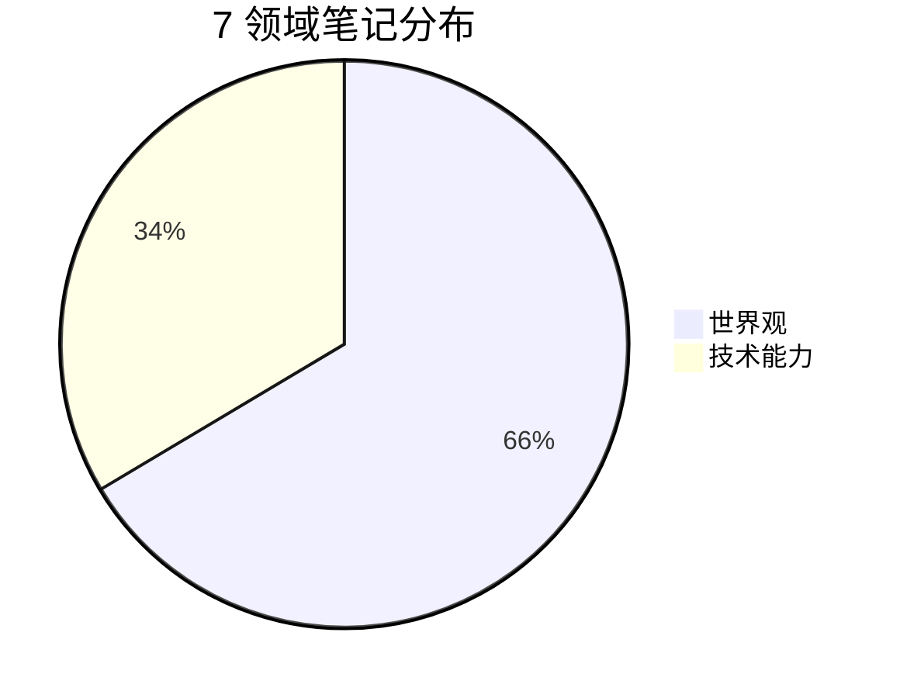

# Obsidian Vault 自动化踩坑记录

## 问题 1：iCloud 路径无法用 Read/Edit 工具直接访问

### 症状
- AI Agent 的 Read/Edit 工具对 iCloud Drive 路径（如 `~/Library/Mobile Documents/iCloud~md~obsidian/Documents/...`）返回权限错误或文件不存在
- Python 脚本 `open()` 可以正常读写同一路径
- 导致所有笔记的读取和修改无法通过工具链直接完成

### 根本原因
1. iCloud Drive 路径含特殊字符（`~`、空格、波浪号），部分工具的路径解析不兼容
2. macOS 对 iCloud 容器有额外的沙盒权限限制，非原生进程可能被拒绝
3. Obsidian Vault 通常存放在 iCloud 同步目录，路径长度和特殊字符叠加

### 解决方案

**方案 A：统一用 Python 脚本读写（推荐）**

所有对 Vault 内文件的操作都通过 Python 脚本完成，AI Agent 只负责编写和运行脚本：

```python
from pathlib import Path

VAULT = Path("/Users/xxx/Library/Mobile Documents/iCloud~md~obsidian/Documents/obsidian")

def read_note(rel_path):
    """读取 vault 内笔记"""
    return (VAULT / rel_path).read_text(encoding="utf-8")

def write_note(rel_path, content):
    """写入 vault 内笔记"""
    path = VAULT / rel_path
    path.parent.mkdir(parents=True, exist_ok=True)
    path.write_text(content, encoding="utf-8")
```

**方案 B：设置环境变量 + 工具直接访问**

将 Vault 复制到普通目录（非 iCloud），用工具直接访问：
```bash
export OBSIDIAN_VAULT=/tmp/obsidian-work
cp -r "~/Library/Mobile Documents/iCloud~md~obsidian/Documents/obsidian/" "$OBSIDIAN_VAULT"
```

**推荐方案**：方案 A。保持 Vault 在 iCloud 同步，脚本读写不破坏同步逻辑。

### 验证清单
- [ ] Python 脚本能读取 Vault 内任意 .md 文件
- [ ] Python 脚本能写入并保存 .md 文件
- [ ] Obsidian 中能看到脚本修改后的内容
- [ ] iCloud 同步正常（修改后其他设备可见）

---

## 问题 2：Frontmatter 解析的边界情况

### 症状
- 脚本给笔记追加 frontmatter 字段时，字段被写到正文区域而非 YAML 头
- `tags` 字段格式不统一（有的是列表，有的是行内数组）
- 重复运行脚本导致同一字段出现多次
- YAML 特殊字符（冒号、引号）导致解析失败

### 根本原因
1. YAML frontmatter 以 `---` 分隔，但部分笔记缺失开头 `---` 或结尾 `---`
2. Obsidian 支持两种 tags 格式：块列表和行内数组
3. 简单的字符串拼接不会检查字段是否已存在
4. `created: 2026-07-21` 中的日期被 YAML 解析为 datetime 对象而非字符串

### 解决方案

**稳健的 frontmatter 解析器（基于行扫描）**

```python
import re

def parse_frontmatter(text):
    """基于行的 frontmatter 解析，避免 YAML 库的边界问题"""
    lines = text.split("\n")
    if not lines or lines[0].strip() != "---":
        return {}, text  # 无 frontmatter
    
    fm_end = None
    for i in range(1, len(lines)):
        if lines[i].strip() == "---":
            fm_end = i
            break
    
    if fm_end is None:
        return {}, text  # 未闭合
    
    fm_text = "\n".join(lines[1:fm_end])
    body = "\n".join(lines[fm_end+1:])
    
    # 简单 key: value 解析
    fm = {}
    current_key = None
    current_list = None
    for line in fm_text.split("\n"):
        # 列表项（以 - 开头）
        if line.strip().startswith("- ") and current_key:
            if current_list is None:
                current_list = []
            current_list.append(line.strip()[2:])
            fm[current_key] = current_list
            continue
        # key: value
        m = re.match(r"^(\w+):\s*(.*)", line)
        if m:
            if current_list is not None:
                current_list = None
            key, val = m.group(1), m.group(2)
            fm[key] = val
            current_key = key
    
    return fm, body


def add_field_if_missing(fm_text, field, value):
    """安全追加字段，避免重复"""
    if re.search(rf"^{field}:", fm_text, re.MULTILINE):
        return fm_text  # 已存在
    # 在 --- 之前插入
    return fm_text.rstrip() + f"\n{field}: {value}\n"
```

### 验证清单
- [ ] 脚本能正确识别有/无 frontmatter 的笔记
- [ ] 重复运行不产生重复字段
- [ ] tags 列表格式保持一致
- [ ] 日期字段不被误解析为 datetime

---

## 问题 3：硬编码个人数据导致脚本不可分享

### 症状
- 脚本中硬编码了 vault 路径、主题映射、关键词列表
- 换一个 vault 运行时，路径找不到、领域映射不匹配
- 分享给他人后完全无法运行

### 根本原因
1. 开发阶段为快速验证，把个人配置直接写在代码里
2. 没有提前设计配置外部化架构
3. 领域映射（文件夹名→领域名）因人而异

### 解决方案

**三级配置降级策略**

```python
import os
from pathlib import Path

def detect_vault():
    """三级降级检测 vault 路径"""
    # 1. 环境变量
    if os.environ.get("OBSIDIAN_VAULT"):
        return Path(os.environ["OBSIDIAN_VAULT"])
    # 2. 当前目录
    if (Path.cwd() / ".obsidian").exists():
        return Path.cwd()
    # 3. 常见位置
    candidates = [
        Path.home() / "Documents" / "obsidian",
        Path.home() / "Library" / "Mobile Documents" / "iCloud~md~obsidian" / "Documents" / "obsidian",
    ]
    for c in candidates:
        if c.exists() and (c / ".obsidian").exists():
            return c
    # 4. 交互输入
    return Path(input("请输入 vault 路径: ").strip())


# 配置外部化到 config.yaml
DEFAULT_DOMAIN_MAP = {
    "职业": "职业发展", "技术": "技术能力", "财富": "财富管理",
    "健康": "健康生活", "家族": "家族传承", "精神": "精神探索", "世界": "世界观",
}
```

### 验证清单
- [ ] 脚本在全新 vault 上能运行（不报路径错误）
- [ ] config.yaml 可自定义领域映射
- [ ] 环境变量 OBSIDIAN_VAULT 优先级最高
- [ ] 无任何硬编码个人路径

---

## 问题 4：Wikilink 重复添加

### 症状
- 语义链接脚本重复运行后，同一对笔记间出现多条相同 wikilink
- "🔗 相关笔记"区块出现重复条目

### 根本原因
1. 脚本没有检查目标 wikilink 是否已存在
2. Obsidian wikilink 有多种格式：`[[笔记名]]`、`[[笔记名|别名]]`、`[[笔记名#标题]]`

### 解决方案

```python
def link_exists(text, target_name):
    """检查 wikilink 是否已存在（覆盖各种格式）"""
    # 匹配 [[target]]、[[target|alias]]、[[target#heading]]
    pattern = rf"\[\[{re.escape(target_name)}(\||\]|#)"
    return bool(re.search(pattern, text))

def add_wikilink_safely(note_text, target_name, reason=""):
    """安全添加 wikilink，自动去重"""
    if link_exists(note_text, target_name):
        return note_text  # 已存在，跳过
    
    link_line = f"- [[{target_name}]]"
    if reason:
        link_line += f" — {reason}"
    
    # 查找或创建 "🔗 相关笔记" 区块
    if "## 🔗 相关笔记" in note_text:
        # 追加到现有区块末尾
        return note_text + link_line + "\n"
    else:
        # 创建新区块
        return note_text.rstrip() + f"\n\n---\n\n## 🔗 相关笔记\n{link_line}\n"
```

### 验证清单
- [ ] 脚本重复运行不产生重复 wikilink
- [ ] 各种 wikilink 格式都能被检测
- [ ] "🔗 相关笔记"区块格式一致

---

## 问题 5：Canvas JSON 格式要求

### 症状
- 升级 Canvas 后，Obsidian 无法打开 .canvas 文件
- 节点颜色不显示
- 连线丢失

### 根本原因
1. Canvas JSON 的 `color` 字段必须是字符串（`"1"`）而非数字（`1`）
2. `json.dumps` 默认 `ensure_ascii=True` 导致中文被转义，Obsidian 无法解析
3. 节点 id 重复导致 Obsidian 渲染异常

### 解决方案

```python
import json

def save_canvas(canvas_data, path):
    """安全保存 Canvas JSON"""
    # 确保颜色是字符串
    for node in canvas_data.get("nodes", []):
        if "color" in node and not isinstance(node["color"], str):
            node["color"] = str(node["color"])
    
    # 确保节点 id 唯一
    ids = set()
    for node in canvas_data.get("nodes", []):
        while node["id"] in ids:
            node["id"] += "_dup"
        ids.add(node["id"])
    
    # 保存，不转义中文，用 tab 缩进（与 Obsidian 原生格式一致）
    path.write_text(
        json.dumps(canvas_data, ensure_ascii=False, indent="\t"),
        encoding="utf-8"
    )
```

### 验证清单
- [ ] Obsidian 能正常打开 .canvas 文件
- [ ] 节点颜色正确显示
- [ ] 连线完整不丢失
- [ ] 中文内容不被转义

---

## 问题 6：Dataview / Mermaid 语法兼容性

### 症状
- MOC 中的 Dataview 块不渲染，显示原始代码
- Mermaid 饼图不显示
- 仪表盘页面空白

### 根本原因
1. Dataview 查询语法要求精确：`FROM "" AND -"编程"` 不能写成 `FROM -"编程"`
2. Mermaid `pie` 语法要求标题和数据之间不能有空行
3. 代码围栏 ` ```dataview ` 前后不能有多余空格

### 解决方案

```markdown
<!-- 正确的 Dataview 语法 -->
```dataview
TABLE field, source
FROM "" AND -"编程" AND -"templates"
WHERE status = "evergreen"
SORT file.name ASC
```

<!-- 正确的 Mermaid pie 语法 -->


<!-- 错误示例：FROM 后缺少空字符串 -->
```dataview
FROM -"编程"  <!-- 这会报错，应为 FROM "" AND -"编程" -->
```
```

### 验证清单
- [ ] Dataview 块正确渲染为表格
- [ ] Mermaid 饼图正确显示
- [ ] 仪表盘页面无空白区域
- [ ] 代码围栏前后无多余空格

---

## 问题 7：scipy 依赖缺失的优雅降级

### 症状
- 层次聚类脚本在未安装 scipy 的环境上报 ImportError
- 用户被迫安装 scipy（编译耗时、可能失败）

### 根本原因
1. 层次聚类算法依赖 scipy.spatial.distance 和 scipy.cluster.hierarchy
2. 部分用户环境（如公司受限网络）无法 pip install scipy

### 解决方案

```python
try:
    from scipy.spatial.distance import pdist, squareform
    from scipy.cluster.hierarchy import linkage, fcluster
    HAS_SCIPY = True
except ImportError:
    HAS_SCIPY = False

def cluster_notes(keyword_matrix):
    """层次聚类，scipy 缺失时降级为简单分组"""
    if HAS_SCIPY:
        # 完整层次聚类
        dist_matrix = pdist(keyword_matrix, metric='jaccard')
        Z = linkage(dist_matrix, method='average')
        labels = fcluster(Z, t=0.5, criterion='distance')
        return labels
    else:
        # 降级：基于关键词重合度的简单分组
        print("⚠️ scipy 未安装，降级为简单分组算法")
        groups = {}
        for i, kw_set in enumerate(keyword_sets):
            for j, other in enumerate(keyword_sets):
                if i < j and len(kw_set & other) >= 3:
                    # 合并到同一组
                    ...
        return simple_labels
```

### 验证清单
- [ ] 有 scipy 时执行完整层次聚类
- [ ] 无 scipy 时降级为简单分组，不报错
- [ ] 降级模式下输出警告信息
- [ ] 两种模式都能生成聚类报告

---

## 问题 8：多 Agent 并行任务编排

### 症状
- 12 个任务串行执行耗时过长
- 单个 Agent 上下文窗口被大量笔记内容撑爆
- 任务间有依赖关系，但并行调度困难

### 根本原因
1. 712 篇笔记的全量扫描结果超出单个 Agent 的上下文窗口
2. 部分任务（如演进链和辩证笔记）互相独立，可以并行
3. 部分任务有依赖（如领域标签必须先于平衡分析）

### 解决方案

**分阶段并行编排策略**

```python
# 阶段划分
PHASES = {
    1: ["health_check", "fix_links", "normalize_tags", "add_metadata"],  # 串行
    2: ["co_occurrence", "assign_domains", "reassess", "activate_status"],  # 串行
    3: [  # 可并行
        ("centrality", "cluster"),  # 数据分析
        ("evolution_chains", "dialectic_notes", "semantic_links"),  # 链接深化
    ],
    4: ["okr_upgrade", "build_dashboard", "upgrade_canvas"],  # 串行
}

# 主 Agent 编排
# 阶段 1+2 串行执行（前置依赖）
# 阶段 3 启动 2 个并行 sub-agent（数据分析 + 链接深化）
# 阶段 4 等阶段 3 完成后串行执行
```

**关键原则**：
1. 把大任务拆成独立子任务，用 sub-agent 并行
2. 每个子任务只返回摘要，不返回原始数据（保护上下文）
3. 有依赖的任务必须串行
4. 每个阶段完成后更新 todo 并检查产出

### 验证清单
- [ ] 并行任务互不干扰
- [ ] 主 Agent 上下文不被撑爆
- [ ] 任务依赖关系正确（阶段 4 等阶段 3）
- [ ] 每个阶段产出可验证

---

## 相关资源
- [Obsidian Dataview 文档](https://blacksmithgu.github.io/obsidian-dataview/)
- [Obsidian Canvas JSON 格式](https://help.obsidian.md/Canvas/Canvas+format)
- [Obsidian Templater 文档](https://silentvoid13.github.io/Templater/)
- [Mermaid 图表语法](https://mermaid.js.org/syntax/pie.html)